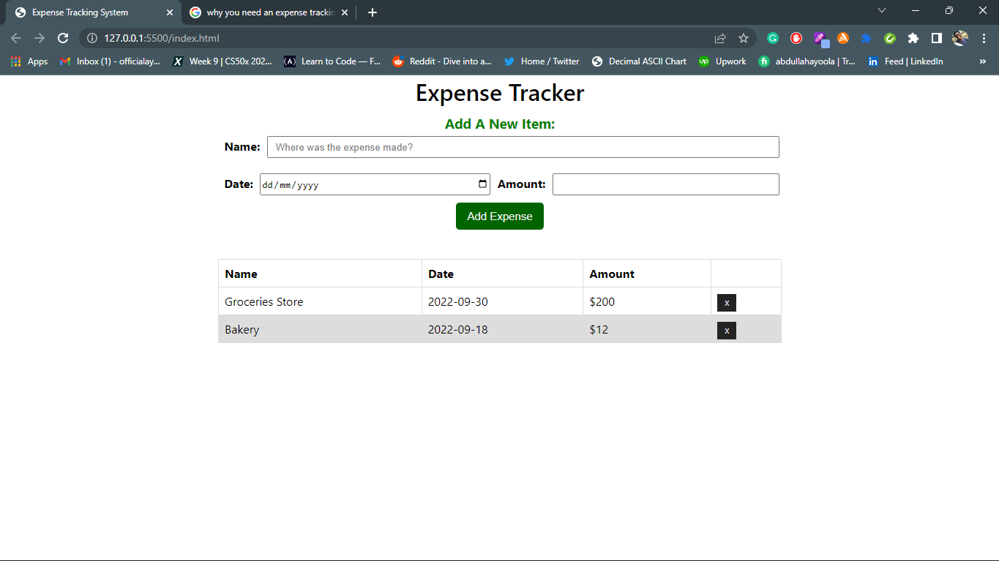

# READ ME

## Details

When you track your spending, you know where your money goes and you can ensure that your money is used wisely. Tracking your expenditures also allows you to understand why you're in debt and how you got there. This will then help you design a befitting strategy of getting out of debt.

